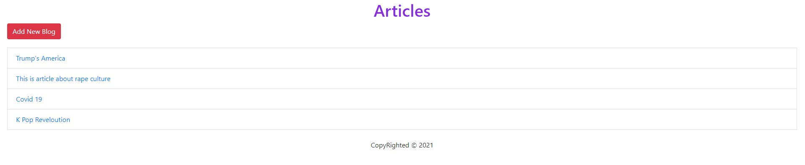
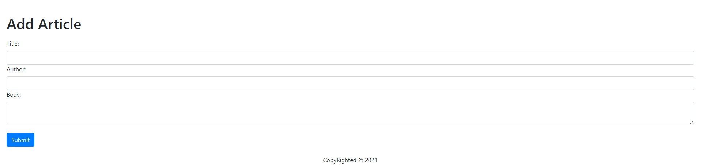
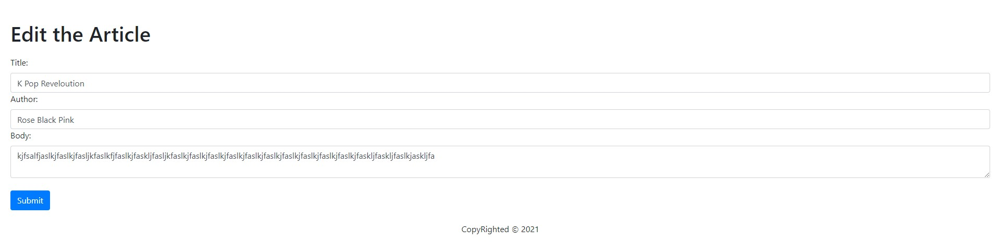
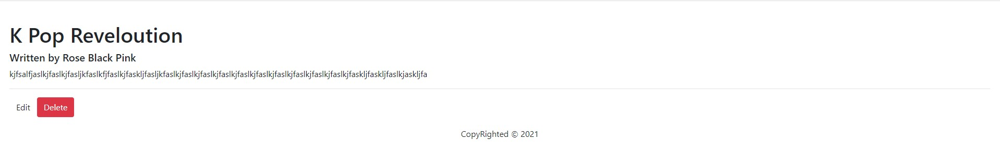

# Simple Articles Site built with Node.js - Mongoose - Express and Bootstrap

1. Bootstrap ✔
2. PUG ✔
3. Express ✔
4. Add, Edit, Delete Articles ✔
5. Mongo and Mongoose integerated ✔
6. JSON response API ✔ (/api/jsonposts)
7. Local host:3000 ✔

# Dependencies 

    "body-parser": "^1.19.0",
    "express": "^4.17.1",
    "mongodb": "^3.6.6",
    "mongoose": "^5.12.7",
    "pug": "^3.0.2"

# Home Page

# Add article (articles/add)

# Edit article (article/edit/:id)

# View article (article/:id)

